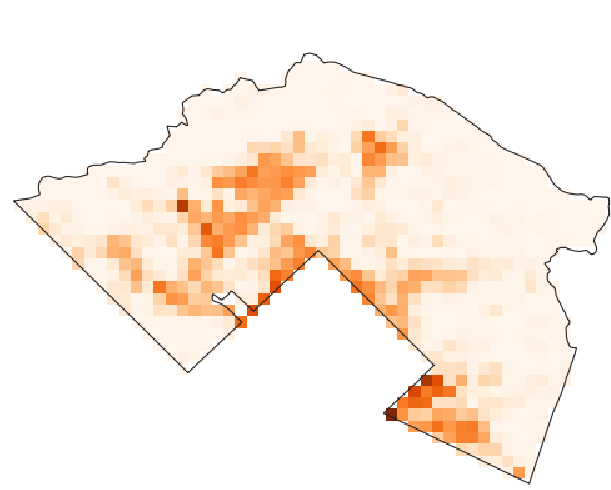
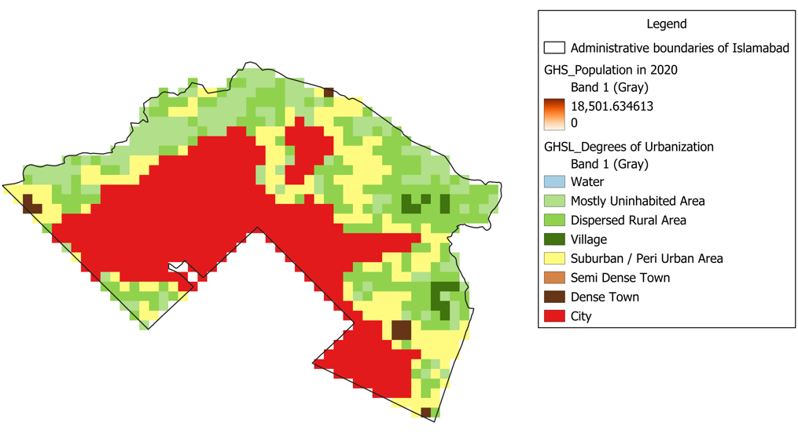
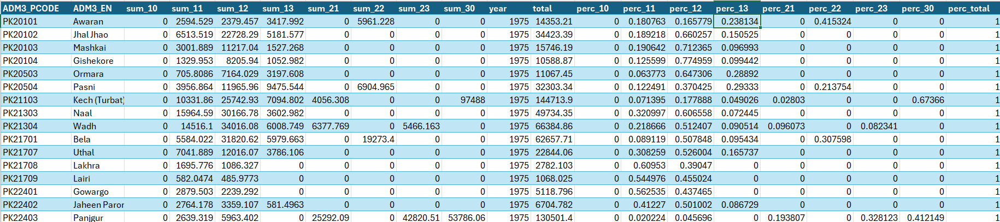

# README

This GitHub repository contains the code that replicates the mapping of high-resolution urban areas in Pakistan implemented by the Poverty and Equity GP's in Pakistan. The two  notebooks implement the various steps taken to classify urban and rural areas into 8 Degrees of Urbanization (DoU) following the work from the [European Space Agency](https://human-settlement.emergency.copernicus.eu/degurba.php).

The official/administrative definition of urban areas in Pakistan does not consider population count as a factor. This creates a disconnect between what is officially classified as a rural area and the actual population concentration.  

The “Degree of Urbanization (DoU)” approach reveals that Pakistan is a more urban country than the official classification suggests. The mismatch between the official urban-/rural classification and socio-economic realities has practical implications for planning and resource allocation.




# Repository Structure

The repository is divided into three folders:

```Folder structure

    |-- Input (git-ignored due to the data size) 
        |-- Year (TIF files for global SMOD and POP raster covering 1975-2030 in 5 year intervals) 
        |-- admin unit (contains boundary shapefile for Pakistan for each administrative level)
    |-- Output
        |--Year (contain SMOD Raster and POP raster for Pakistan and CSV files which sum up the population in each SMOD level for admin level 0-3 for different years 1975- 2030 with 5 year intervals)
    |-- Code (Two Python scripts)
```

# Environment Setup

This work was done using Python 3.11.8 on Anaconda instances running in a Windows virtual machine. The repository contains a *.txt* file listing all the Python libraries referenced and how to call them pn *2024_Geospatial Anaconda Environment Setup* That is the first thing you should run!

# Data Overview

1. The source for shapefiles with Pakistan administrative boundaries is the Common Operational Datasets 2022 from UNOCHA [humdata](https://data.humdata.org/dataset/cod-ab-pak?). It has four administrative levels (ADM1 to ADM4) .

2. GHS-POP is a dataset that merges satellite-derived information on built-up areas with census data to estimate the number of people worldwide. Grid cells with more built-up areas are assumed to have higher population densities. The data was downloaded from the website at 1km resolution and MollWeide Projection [GHS Pop](https://ghsl.jrc.ec.europa.eu/download.php?ds=pop).  The data was downloaded for  1975-2030 (5-year intervals).

3. The GHS Settlement Model (GHS-SMOD) layers comprehensively classify settlement types, utilizing population size, population density, and built-up area density as key indicators. Derived from the GHS-POP and GHS-BUILT SURFACE AREA datasets, it comprises the GHS-SMOD spatial raster dataset that classifies the area into 7 degrees of urbanization (1975-2030, 5-year intervals). It was downloaded at 1km resolution and MollWeide Projection from the website [GHS SMOD](https://ghsl.jrc.ec.europa.eu/download.php?ds=smod). The eight DoUs are classified as

| Code      | Category   |
| --------  | ------- |
| 10       | Water (Water Grid Cell) | Contains no population
| 11       | Mostly Uninhabited Areas (Very Low-Density Gird Cell) |
| 12       | Dispersed Rural Areas (Low-Density Grid Cell) |
| 13       | Villages (Rural Cluster) |
| 21       | Suburban/ Peri-Urban Areas (Semi Dense Grid Cell) |
| 22       | Semi Dense Town (Semi Dense Urban Cluster) |
| 23       | Dense Town (Dense Urban Cluster) |
| 30       | City (Urban Center) |

# Running the Code

To run the code, pull the repository to obtain the same folder structure. There are three subfolder: Input, Output and Code

1. The Input folder has

   a. 12 sub-folders titled after each year from 1975 to 2030 with 5-year intervals. Each year's sub-folder contains:

       i. Global GHS SMOD  raster files downloaded from the website stated above. 
       ii. Global GHS POP  raster files downloaded from the website stated above.
   b. It also has an admin unit folder which contains the shapefiles for Pakistan at 4 administrative levels- the shapefile is clipped to exclude the disputed territory (AJK and GB).

As the Input folder has been gitignore due to the size, one can access the Input folder from OneDrive [OneDrive_input_files](https://worldbankgroup.sharepoint.com/:f:/r/sites/PKISBFiles/Shared%20Documents/Poverty_Equity_Pak/DATA_PAK/Geospatial%20Data/PAK%20GSDL%20Projects/GHSL_Degrees%20of%20Urbanization/GHS%20Pop_Degrees%20of%20Urbanisation/Input?csf=1&web=1&e=RXVt4S)

2. The Output folder has 12 subfolders, with the year used as a title.  Each sub-folder contains 2 types of outputs:

    * a) Pakistan GHS SMOD and GHS POP raster file (created after clipping the global GHS SMOD and GHS POP rasters using the Pakistan boundary shapefiles).
    * b) CSV files containing the population living in different SMOD levels for each administrative unit (national, provincial, district and tehsil)

3. The *Code* folder has two python scripts, which must be run in the following order:

    * i) Degrees_of_Urbanization.py: It calculates the total number of people in each degrees of urbanisation and different administrative levels: national, provincial, district and tehsil.
    
        The code works for Pakistan, but can be modified for different countries. In that case, the shapefiles in the admin units folder must be changed, adjusting the file names and columns indicating the administrative units to match the code.
        
        ```
        Change  "pak_admbnda_adm0_wfp_20220909" in the "shape_file = os.path.join(input_dir, "pak_admbnda_adm0_wfp_20220909")" to the name of the shapefile of the country.
        
        Change the "pak_admbnda_adm0_wfp_20220909" to the title of your shapefile
        shape_file = os.path.join(input_dir, "pak_admbnda_adm0_wfp_20220909")- 
                    
        adm = []
        for file in shape_files:
            if file.endswith(".shp"): 
                if "adm0" in file:   #you may need to change adm to whatever is the denotes the administration level in that shapefile
                    shortnm = 'adm0'
                elif "adm1" in file:
                    shortnm = 'adm1'
                elif "adm2" in file:
                    shortnm = 'adm2'
                elif "adm3" in file:
                    shortnm = 'adm3'
        ```


    * ii)  Urban Percentages.py: Loads the outputs from (i), and combines them into results at different administrative lvels (4 CSV files in our case). No changes are required for this code to run if the directories are created as is.
    
        For the ADM3 level, tehsil in Paksitan, the output displays as:
   
        

        | Name                  | Description   |
        | --------              | ------- |
        | year                  |  Year |
        | ADM3_PCODE            |  Tehsil Pcode |
        | ADM3_EN               |  Name of the tehsil  |
        | total                 |  Total population in the tehsil |
        | perc_total            |  Total percentage of sum_* categories|
        | sum_10                |  Sum of the people living in SMOD category 10 |
        | sum_11                |  Sum of the people living in SMOD category 11 |
        | sum_12                |  Sum of the people living in SMOD category 12 |
        | sum_13                |  Sum of the people living in SMOD category 13 |
        | sum_21                |  Sum of the people living in SMOD category 21 |
        | sum_22                |  Sum of the people living in SMOD category 22 |
        | sum_23                |  Sum of the people living in SMOD category 23 |
        | sum_30                |  Sum of the people living in SMOD category 30 |
        | perc_10               |  Percentage of people living in SMOD category 10 |
        | perc_11               |  Percentage of people living in SMOD category 11 |
        | perc_12               |  Percentage of people living in SMOD category 12 |
        | perc_13               |  Percentage of people living in SMOD category 13 |
        | perc_21               |  Percentage of people living in SMOD category 21 |
        | perc_22               |  Percentage of people living in SMOD category 22 |
        | perc_23               |  Percentage of people living in SMOD category 23 |
        | perc_30               |  Percentage of people living in SMOD category 30 |

